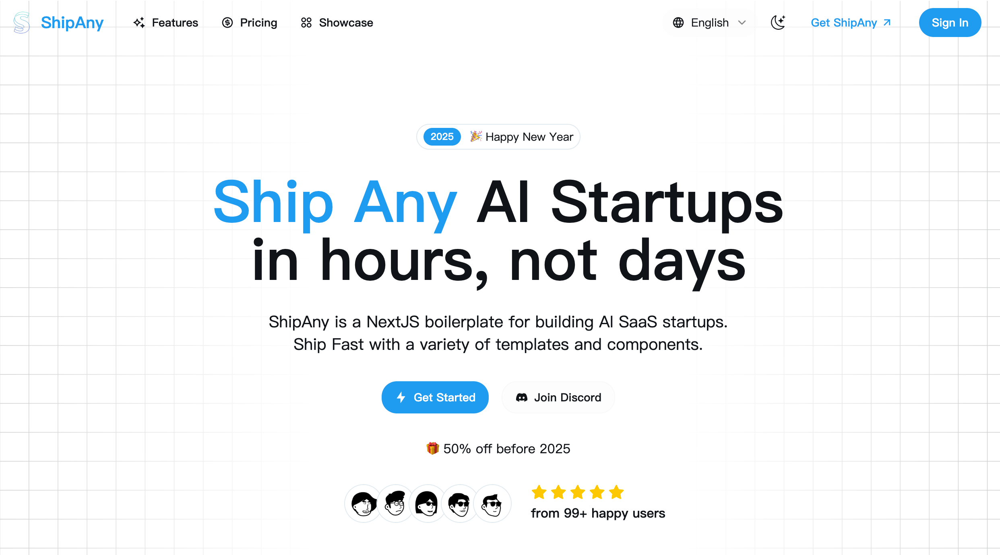

# Nano Banana Pro

Smart AI image editing, enhancement, and transformation tool — live at https://www.nanobananapro.lol.



## Quick Start

1. Clone the repository

```bash
git clone https://github.com/shipanyai/shipany-template-one.git
```

2. Install dependencies

```bash
npm install
```

3. Run the default web development server

```bash
npm run dev
```

`npm run dev` now auto-starts the local backend on `http://127.0.0.1:5000` when
the backend target is local. Set `BACKEND_AUTOSTART=false` to keep frontend-only
development and start the backend manually.

## Runtime Profiles

This repo uses isolated Next.js output directories so concurrent local runtimes cannot corrupt each other's manifests or chunks.

- `npm run dev` or `npm run dev:web`: normal local development on `http://localhost:3000`
- `npm run dev:playwright`: browser-test runtime on `http://localhost:3002` with `NEXT_PUBLIC_AUTH_DISABLED=true`
- `npm run dev:turbo`: experimental Turbopack dev server using the same isolated web profile
- `npm run build`: production build written to `.next/build`
- `npm run start`: serves the production build from `.next/build`
- `npm run dev:reset`: removes `.next/dev-web`, `.next/dev-playwright`, `.next/build`, runtime locks, and test artifacts

Do not run bare `next dev` in this repository. Use the npm scripts so each runtime gets its own `distDir` and lock guard.

## Testing

Run the runtime guard tests:

```bash
npm run test:runtime
```

Run browser tests:

```bash
npm run test:e2e
```

The homepage hydration regression is covered by Playwright. It fails if the homepage loads with missing `/_next/static/chunks/...` assets or loses client interactivity.

## Browser Debug Scripts

Ad hoc browser debug scripts now live under `scripts/browser-debug/` and read `TEST_BASE_URL` instead of hardcoding `http://localhost:3000`.

Examples:

```bash
TEST_BASE_URL=http://localhost:3000 npx tsx scripts/browser-debug/test-signin-click.ts
TEST_BASE_URL=http://localhost:3002 npx tsx scripts/browser-debug/test-deploy-button.ts
```

## Customize

- Set your environment variables

```bash
cp .env.example .env.development
```

- Set your theme in `src/app/theme.css`

[tweakcn](https://tweakcn.com/editor/theme)

- Set your landing page content in `src/i18n/pages/landing`

- Set your i18n messages in `src/i18n/messages`

## Deploy

当前部署平台为 **K8s + ArgoCD**。

### 已上线

| 环境 | 入口域名 | ArgoCD App | 配置仓库 |
|------|---------|-----------|---------|
| 生产 | [rekaclip.homes](https://rekaclip.homes) | `rekaclip-homes` | k8s-fleet `tenants/rekaclip-homes/` |

部署详情见 [deploy/DEPLOY.md](deploy/DEPLOY.md) 第 14 节。

### 发布新版本

```bash
# 构建 + 推送镜像
docker build --build-arg BUILD_ENV_FILE=deploy/k8s/build-env/production.env \
  -t ghcr.io/gateszhangc/rekaclip-homes:<新tag> .
echo $(gh auth token) | docker login ghcr.io -u gateszhangc --password-stdin
docker push ghcr.io/gateszhangc/rekaclip-homes:<新tag>

# 更新 k8s-fleet 的 tenants/rekaclip-homes/kustomization.yaml 中 newTag
# 提交推送后 ArgoCD 自动同步
```

### 规划中

| 环境 | 域名 | 说明 |
|------|------|------|
| Production (全栈) | www.rekaclip.homes | web + backend + PostgreSQL，见 `deploy/k8s/overlays/production/` |
| Staging | staging.rekaclip.homes | 见 `deploy/k8s/overlays/staging/` |

## Community

- [ShipAny](https://shipany.ai)
- [Documentation](https://docs.shipany.ai)

## License

- [ShipAny AI SaaS Boilerplate License Agreement](LICENSE)
