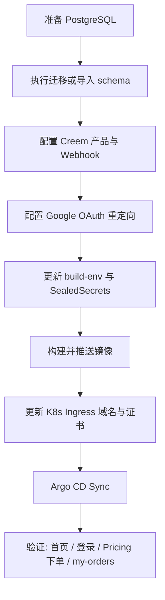

# Reka Clip 部署前配置清单

本文说明从本地开发部署到 **Staging / Production（K8s + Argo CD）** 前必须核对与修改的配置。当前 `deploy/k8s` 已改为 **RekaClip** 命名与域名。

---

## 1. 配置分层（先理解再改）

| 层级 | 文件 / 位置 | 何时生效 | 典型内容 |
|------|-------------|----------|----------|
| **构建时（打进前端 bundle）** | `deploy/k8s/build-env/production.env`、`staging.env` | `docker build --build-arg BUILD_ENV_FILE=...` | 所有 `NEXT_PUBLIC_*` |
| **运行时（Pod 环境变量）** | `.env.production` → 加密为 SealedSecret | K8s `rekaclip-web-env` | `DATABASE_URL`、`AUTH_*`、`CREEM_*`、密钥类 |
| **集群 / 路由** | `deploy/k8s/overlays/*/rekaclip-*.ingress.yaml`、Certificate | Ingress / TLS | 域名、证书 |
| **Argo CD** | `deploy/argocd/*.yaml` | GitOps 同步 | 仓库 URL、分支、overlay 路径 |
| **镜像** | `deploy/k8s/base/*-deployment.yaml` | 拉取容器 | 镜像仓库与 tag |
| **数据库** | 托管 PostgreSQL + `deploy/db/*` | 应用启动 / 迁移 | 连接串、表结构 |

本地开发对照：`.env.development`（勿直接用于生产）。

---

## 2. 品牌与域名（Reka Clip 独立站必改）

当前生产仍指向 `rekaclip.homes`，部署 Reka Clip 新域名时需改：

### 2.1 域名与 TLS

| 文件 | 修改项 |
|------|--------|
| `deploy/k8s/overlays/production/rekaclip-live.ingress.yaml` | `rules[].host`、`tls.hosts` → 新域名（如 `www.rekaclip.com`） |
| `deploy/k8s/overlays/production/rekaclip-live.certificate.yaml` | `dnsNames` 与 Ingress 一致 |
| `deploy/k8s/overlays/staging/rekaclip-staging.ingress.yaml` | Staging 子域 |
| 对应 `*.certificate.yaml` | cert-manager 签发域名 |

### 2.2 公网 URL（构建时 + 运行时都要一致）

| 变量 | 说明 | 示例 |
|------|------|------|
| `NEXT_PUBLIC_WEB_URL` | 站点根 URL，影响 OG、回调、邮件链接 | `https://www.rekaclip.com` |
| `AUTH_URL` | next-auth 回调基址 | `https://www.rekaclip.com/api/auth` |
| `NEXTAUTH_URL` | 与 `AUTH_URL` 相同（兼容旧配置） | 同上 |
| `AUTH_TRUST_HOST` | 反向代理后建议 `true` | `true` |

构建 env：`deploy/k8s/build-env/production.env` 第 23 行 `NEXT_PUBLIC_WEB_URL`。

运行时：更新 SealedSecret 中对应键，或使用：

```bash
PRODUCTION_URL=https://www.rekaclip.com \
  scripts/production/render-dokploy-env.sh /tmp/web.env
```

### 2.3 项目标识（支付 metadata）

| 变量 | 说明 |
|------|------|
| `NEXT_PUBLIC_PROJECT_NAME` | 写入 Creem checkout metadata 的 `project` 字段；建议改为 `rekaclip` |

构建 env：`production.env` / `staging.env` 中 `NEXT_PUBLIC_PROJECT_NAME`。

---

## 3. 数据库

### 3.1 连接

| 变量 | 说明 |
|------|------|
| `DATABASE_URL` | 生产 PostgreSQL 连接串（建议独立库/用户，SSL） |
| `DB_WRITE_FREEZE` | 紧急只读时设为 `true`；正常为 `false` |

Schema 名仍为 **`rekaclip`**（代码未改 schema 名）。

### 3.2 初始化方式（三选一）

1. **推荐（空生产库）**  
   - 创建库与用户 → 配置 `DATABASE_URL`  
   - 执行 Drizzle 迁移：`npm run db:migrate`  
   - **重要：** `src/db/migrations/meta/_journal.json` 目前只登记到 `0001`，磁盘上还有 `0002`–`0006`。若 `db:migrate` 后缺表（如 `manual_payment_requests`），需补跑：  
     `psql "$DATABASE_URL" -f src/db/migrations/0004_add_manual_payment_requests.sql`（及 0002、0003、0005、0006 按需）  
   - 或参考 `deploy/db/migrations_combined.sql` 一次性执行。

2. **从本地快照恢复（仅 dev/staging 克隆）**  
   ```bash
   psql "$DATABASE_URL" -f deploy/db/00_schema.sql
   psql "$DATABASE_URL" -f deploy/db/01_data.sql
   ```  
   见 `deploy/db/README.md`。`01_data.sql` 含测试数据，**不要**用于生产。

3. **重新导出本地库**  
   ```bash
   bash deploy/db/export.sh
   ```

### 3.3 K8s 中配置

加密并更新：

- `deploy/k8s/overlays/production/web-env.sealedsecret.yaml` → `DATABASE_URL`
- 若 backend 连库：`backend-env.sealedsecret.yaml`

使用 [Sealed Secrets](https://github.com/bitnami-labs/sealed-secrets) 从明文 Secret 生成，勿把明文提交 Git。

---

## 4. 认证（Google / next-auth）

| 变量 | 部署前检查 |
|------|------------|
| `AUTH_SECRET` | 生产独立随机值：`openssl rand -base64 32` |
| `AUTH_URL` / `NEXTAUTH_URL` | 必须为 **HTTPS** 生产域名 + `/api/auth` |
| `AUTH_GOOGLE_ID` / `AUTH_GOOGLE_SECRET` | Google Cloud Console OAuth 客户端 |
| `NEXT_PUBLIC_AUTH_GOOGLE_ID` | 与 `AUTH_GOOGLE_ID` 相同（前端 One Tap） |
| `NEXT_PUBLIC_AUTH_GOOGLE_ENABLED` | `true` |
| `NEXT_PUBLIC_AUTH_GOOGLE_ONE_TAP_ENABLED` | 按需 |
| `NEXT_PUBLIC_AUTH_DISABLED` | 生产必须为 **`false`** |
| `AUTH_GITHUB_*` | 若不用 GitHub 登录，保持 `NEXT_PUBLIC_AUTH_GITHUB_ENABLED=false` |

**Google Console 必配：**

- **Authorized JavaScript origins：** `https://www.<你的域名>`
- **Authorized redirect URIs：** `https://www.<你的域名>/api/auth/callback/google`

本地客户端 ID 不能用于生产域名，需新建或增加 URI。

---

## 5. 支付（Creem）

Reka Clip Pricing 使用以下 **逻辑 product id**（代码内键名），映射到 Creem 实际 `prod_*`：

| 逻辑 ID | 用途 |
|---------|------|
| `starter-monthly` | Starter 月付 |
| `pro-monthly` | Pro 月付 |
| `starter-yearly` | Starter 年付 |
| `pro-yearly` | Pro 年付 |

| 变量 | 说明 |
|------|------|
| `PAY_PROVIDER` | 固定 `creem` |
| `CREEM_ENV` | 测试：`test`；上线：`production` |
| `CREEM_API_KEY` | 与 `CREEM_ENV` 匹配的 API Key |
| `CREEM_WEBHOOK_SECRET` | Creem 后台 Webhook 签名密钥 |
| `CREEM_PRODUCTS` | JSON 字符串，键为上表逻辑 ID，值为 Creem `prod_xxx` |

示例（占位，勿照抄）：

```json
{
  "starter-monthly": "prod_xxx",
  "pro-monthly": "prod_xxx",
  "starter-yearly": "prod_xxx",
  "pro-yearly": "prod_xxx"
}
```

**Creem 后台：**

1. 创建/核对 4 个产品与定价是否与前端展示一致（$12.99/$22.99 月付等）。  
2. Webhook URL：`https://www.<域名>/api/pay/notify/creem`（以项目实际路由为准）。  
3. Success URL 由代码生成，依赖 `NEXT_PUBLIC_WEB_URL`。

| 变量 | 说明 |
|------|------|
| `NEXT_PUBLIC_PAY_SUCCESS_URL` | 默认 `/my-orders` |
| `NEXT_PUBLIC_PAY_FAIL_URL` / `NEXT_PUBLIC_PAY_CANCEL_URL` | 默认 `/pricing` |
| `NEXT_PUBLIC_PAUSE_CHECKOUT` | 维护时 `true` 关闭下单 |

本地 `.env.development` 使用 `CREEM_ENV=test`；生产 SealedSecret 必须用 **production** 密钥与产品 ID。

---

## 6. 后端 API（Clip / Boost 等）

| 变量 | 说明 |
|------|------|
| `BACKEND_BASE_URL` | 服务端调用 Python/Node 后端（K8s 内可用 `http://rekaclip-backend:5001`） |
| `NEXT_PUBLIC_API_URL` | 浏览器可访问的 API 根（生产应为 HTTPS 或同源代理） |
| `NEXT_PUBLIC_DEPLOY_SUBSCRIPTION_CHECK_ENABLED` | OpenClaw 部署门禁；纯 Clip 可 `false` |

K8s：

- `deploy/k8s/base/backend-deployment.yaml` — 镜像 tag  
- `deploy/k8s/overlays/*/backend-env.sealedsecret.yaml` — `PORT`、`DATABASE_URL`、`ENCRYPTION_KEY` 等（见 `backend/.env`）

构建时 `production.env` 已写集群内服务名：

```
BACKEND_BASE_URL=http://rekaclip-backend:5001
NEXT_PUBLIC_API_URL=http://rekaclip-backend:5001
```

若前端在浏览器直连公网 API，需把 `NEXT_PUBLIC_API_URL` 改为公网 HTTPS 并在后端配置 CORS。

---

## 7. 对象存储（上传 / 生成资源）

| 变量 | 说明 |
|------|------|
| `STORAGE_ENDPOINT` | S3 兼容端点（如 Cloudflare R2） |
| `STORAGE_REGION` | R2 多为 `auto` |
| `STORAGE_ACCESS_KEY` / `STORAGE_SECRET_KEY` | 访问密钥 |
| `STORAGE_BUCKET` | 桶名 |
| `STORAGE_DOMAIN` | 公网访问域名（CDN/R2 public URL） |

生产建议使用 **独立 bucket** 与密钥，权限最小化。

---

## 8. 分析与监控

| 变量 | 说明 |
|------|------|
| `NEXT_PUBLIC_GOOGLE_ANALYTICS_ID` | GA4 Measurement ID |
| `GA4_API_SECRET` | 服务端 Measurement Protocol（若启用） |
| `NEXT_PUBLIC_CLARITY_PROJECT_ID` | Microsoft Clarity |
| `NEXT_PUBLIC_SENTRY_DSN` | 前端 Sentry |
| `NEXT_PUBLIC_OPENPANEL_CLIENT_ID` / Plausible | 可选 |

构建 env 中 `NEXT_PUBLIC_*` 需在 **构建镜像前** 写入 `build-env/production.env`，否则前端统计 ID 不会更新。

---

## 9. 其他运行时变量

| 变量 | 说明 |
|------|------|
| `ADMIN_EMAILS` | 逗号分隔管理员邮箱（后台权限） |
| `NEXT_PUBLIC_DEFAULT_THEME` | Reka 落地页建议 `dark` |
| `NEXT_PUBLIC_LOCALE_DETECTION` | 通常 `false` |
| `NEXT_PUBLIC_PAUSE_CHECKOUT` | 暂停购买 |
| `REPLICATE_API_TOKEN` | 若仍使用 Replicate 生图 |
| `MOCK_OUTFIT_GENERATION` | 生产应为 `false` 或删除 |
| `BAIDU_OCR_*` | 若使用百度 OCR |

---

## 10. Kubernetes / Argo CD / 镜像

### 10.1 镜像构建

```bash
docker build \
  --build-arg BUILD_ENV_FILE=deploy/k8s/build-env/production.env \
  -t <registry>/rekaclip-web:<tag> .
```

推送后更新 `deploy/k8s/base/web-deployment.yaml` 中 `image:`。

Backend 同理：`rekaclip-backend` 镜像与 `backend-deployment.yaml`。

### 10.2 必改清单（独立 Reka Clip 时）

| 项 | 文件 |
|----|------|
| 镜像仓库地址 | `web-deployment.yaml`、`backend-deployment.yaml` |
| 拉取密钥 | `registry-pull.sealedsecret.yaml` |
| Web 运行时 Secret | `web-env.sealedsecret.yaml`（整份重 seal） |
| Backend Secret | `backend-env.sealedsecret.yaml` |
| Ingress / Certificate 域名 | `overlays/production/rekaclip-live.*` |
| Argo 仓库 URL | `deploy/argocd/rekaclip-production.yaml` → 指向本仓库与分支 |
| Namespace / 应用名 | 可选：将 `rekaclip` 改为 `rekaclip`（涉及 kustomization 多处 label） |

### 10.3 Argo CD

`deploy/argocd/rekaclip-production.yaml`：

- `spec.source.repoURL` — Git 仓库  
- `spec.source.path` — `deploy/k8s/overlays/production`  
- `spec.destination.namespace` — 默认 `rekaclip`

修改后 `argocd app sync` 或等待自动同步。

---

## 11. 部署顺序建议



**验收检查：**

1. `https://<域名>/` — Reka Clip 落地页  
2. Google 登录成功，session 正常  
3. `/pricing` 跳转 Creem 测试/生产 checkout  
4. Webhook 后订单状态与积分到账  
5. `/my-orders` 无 500（`manual_payment_requests` 等表存在）  
6. Clip「Make Magic」未登录弹登录、未付费跳 Pricing  

---

## 12. 环境对照表（快速）

| 配置项 | 本地 `.env.development` | Staging | Production |
|--------|------------------------|---------|------------|
| `NEXT_PUBLIC_WEB_URL` | `http://localhost:3000` | `https://staging.*` | `https://www.*` |
| `CREEM_ENV` | `test` | `test` 或 `production` | `production` |
| `DATABASE_URL` | 本地 `rekaclip` | Staging DB | 托管 PG + SSL |
| `AUTH_URL` | `http://localhost:3000/api/auth` | Staging 域名 | 生产 HTTPS |
| 构建 env 文件 | — | `build-env/staging.env` | `build-env/production.env` |

---

## 13. 相关路径

- 数据库导出：`deploy/db/`  
- K8s 清单：`deploy/k8s/`  
- 构建用公开变量：`deploy/k8s/build-env/`  
- 生产 env 渲染脚本：`scripts/production/render-dokploy-env.sh`  
- Drizzle 迁移：`src/db/migrations/`  
- 环境模板：`.env.example`

如有新域名或新 Creem 账号，优先改 **SealedSecret + build-env + Google/Creem 控制台**，再构建镜像，避免"前端旧 URL、后端新密钥"不一致。

---

## 14. rekaclip.homes 部署（Next.js 运行时）

`rekaclip.homes` 通过 **k8s-fleet 租户** 部署，运行完整 Next.js 应用（10-12 节的全栈部署暂未上线时这里替代入口）。

### 14.1 部署概览

```
本地源码 → Docker build (BUILD_ENV_FILE) → ghcr.io → k8s-fleet tenant → ArgoCD auto-sync
```

| 项目 | 值 |
|------|-----|
| 部署方式 | k8s-fleet 租户（tenants/rekaclip-homes/） |
| 运行时 | Next.js standalone (Node.js, port 3000) |
| K8s namespace | `rekaclip-homes` |
| Ingress | `rekaclip-homes-live` |
| 域名 | `rekaclip.homes` + `www.rekaclip.homes`（Next.js 内部 308 重定向到 `www.rekaclip.homes`） |
| TLS | cert-manager (`rekaclip-homes-live-tls`)，双域名证书 |
| Service | `rekaclip-homes` (ClusterIP, :80 → targetPort :3000) |
| Deployment | `rekaclip-homes` (1 replica, port 3000) |
| Docker 镜像 | `ghcr.io/gateszhangc/rekaclip-homes:1.0.3` |
| 镜像拉取密钥 | `ghcr-pull-secret` (imagePullSecrets) |
| 运行时 Secret | `rekaclip-web-env` (CREEM_* 凭据) |
| 管理工具 | ArgoCD → k8s-fleet repo `tenants/rekaclip-homes/` |

### 14.2 K8s 资源（在 k8s-fleet 仓库中）

```
repo: gateszhangc/k8s-fleet (main) → tenants/rekaclip-homes/
├── kustomization.yaml              (newTag: 1.0.3)
├── 00-namespace.yaml
├── 20-rekaclip-homes-deployment.yaml
│   ├── imagePullSecrets: ghcr-pull-secret
│   ├── envFrom: rekaclip-web-env (Creem runtime secrets)
│   ├── containerPort: 3000
│   └── probes: HTTP on :3000
├── 21-rekaclip-homes-service.yaml  (targetPort: 3000)
├── 31-rekaclip-homes-live-certificate.yaml  (dnsNames: rekaclip.homes, www.rekaclip.homes)
└── 32-rekaclip-homes-live-ingress.yaml       (hosts: rekaclip.homes, www.rekaclip.homes)

platform: manifests/platform/40-rekaclip-homes-application.yaml
```

### 14.3 DNS 与 证书

Cloudflare DNS（zone: `rekaclip.homes`）：

| 类型 | 名称 | 目标 | Proxy |
|------|------|------|-------|
| A | `rekaclip.homes` | `144.91.77.245` | 是 |
| CNAME | `www.rekaclip.homes` | `rekaclip.homes` | 是 |

证书覆盖双域名（`rekaclip.homes` + `www.rekaclip.homes`），HTTP-01 验证。

> **注意：** 如果 `www` 的 CNAME 指向 `pixie.porkbun.com`（deploy-site 初始部署留下的），会导致 HTTP-01 验证失败（525 或 530），证书永远签不下来。修复方式：删除该 CNAME，改为指向 `rekaclip.homes`。

### 14.4 发布新版本流程

```bash
# 1. 构建镜像（注入构建时环境变量）
docker build \
  --build-arg BUILD_ENV_FILE=deploy/k8s/build-env/production.env \
  -t ghcr.io/gateszhangc/rekaclip-homes:<新tag> \
  -t ghcr.io/gateszhangc/rekaclip-homes:latest \
  .

# 2. 推送
echo $(gh auth token) | docker login ghcr.io -u gateszhangc --password-stdin
docker push ghcr.io/gateszhangc/rekaclip-homes:<新tag>
docker push ghcr.io/gateszhangc/rekaclip-homes:latest

# 3. 确保 imagePullSecrets 存在
kubectl create namespace rekaclip-homes 2>/dev/null
kubectl create secret docker-registry ghcr-pull-secret \
  --namespace=rekaclip-homes \
  --docker-server=ghcr.io \
  --docker-username=gateszhangc \
  --docker-password="$(gh auth token)" \
  --dry-run=client -o yaml | kubectl apply -f -

# 4. 更新 k8s-fleet 仓库 tenants/rekaclip-homes/kustomization.yaml 的 newTag
#    提交推送后 ArgoCD 自动同步
```

### 14.5 证书故障排查

若 `www.rekaclip.homes` 出现 525 错误：

```bash
# 1. 检查 Cloudflare DNS — www CNAME 是否指向 rekaclip.homes（而非 pixie.porkbun.com）
curl -s "https://api.cloudflare.com/client/v4/zones/<ZONE_ID>/dns_records?type=CNAME" \
  -H "Authorization: Bearer ${CLOUDFLARE_API_TOKEN}"

# 2. 检查 cert-manager 状态
kubectl get certificate,order,challenge -n rekaclip-homes
```

### 14.6 验证

```bash
# 检查 Pod
kubectl get pods -n rekaclip-homes
# ArgoCD 同步状态
kubectl get application -n argocd rekaclip-homes
# HTTP 验证
curl -I https://rekaclip.homes
curl -I https://www.rekaclip.homes
```

### 14.5 与 10-12 节全栈部署的关系

| 方面 | rekaclip.homes (k8s-fleet 租户) | 全栈部署 (10-12 节) |
|------|-------------------------------|------|
| 运行时 | Next.js standalone, Node.js:3000 | web:3000 + backend:5001 |
| 镜像仓库 | ghcr.io | registry.144.91.77.245.sslip.io |
| K8s namespace | `rekaclip-homes` | `rekaclip` |
| 配置文件 | k8s-fleet 仓库 `tenants/rekaclip-homes/` | 本仓库 `deploy/k8s/overlays/` |
| DNS/TLS | rekaclip.homes | www.rekaclip.homes |
| Database | 无直接依赖 | PostgreSQL |
| 状态 | **已部署** (tag 1.0.1) | 尚未上线
